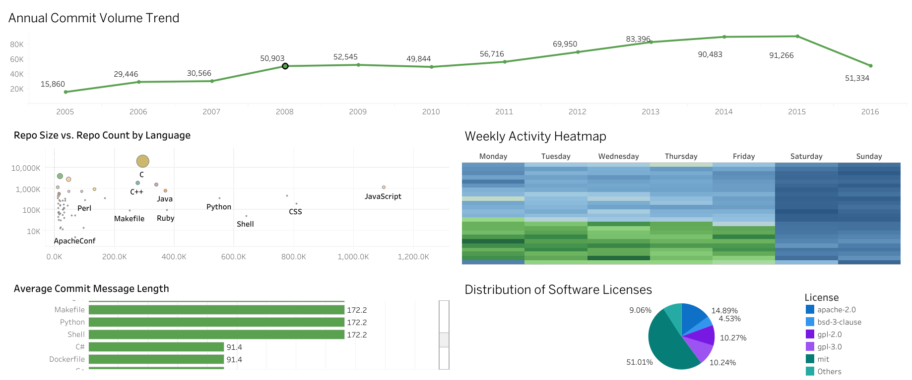

# 📊 GitHub Open Source Ecosystem Analysis (2005-2016)

An end-to-end data analytics project exploring the evolution, habits, and structure of the global open-source community on GitHub.

Data was extracted from the massive **[GitHub Public Dataset on Google BigQuery](https://console.cloud.google.com/marketplace/product/github/github-repos)** using SQL, transformed into summarized CSV files, and visualized in a comprehensive Tableau dashboard.

**🔗 [CLICK HERE TO VIEW THE INTERACTIVE DASHBOARD ON TABLEAU PUBLIC](https://public.tableau.com/views/GitHubEcosystemAnalysis/Dashboard1?:language=en-US&publish=yes&:sid=&:redirect=auth&:display_count=n&:origin=viz_share_link)**
**🗄️ [CLICK HERE TO EXPLORE THE RAW DATASET ON BIGQUERY](https://console.cloud.google.com/bigquery?p=bigquery-public-data&d=github_repos&page=dataset)**

---

## 🛠️ Tech Stack & Tools

- **Data Source:** `bigquery-public-data.github_repos`
- **Data Extraction:** Google BigQuery (Standard SQL)
- **Data Processing & Aggregation:** SQL
- **Data Visualization:** Tableau Public
- **Data Format:** CSV

## 💡 Key Insights & Findings

This dashboard provides a macro-level view of the GitHub ecosystem, revealing several interesting patterns:

- **The Golden Age of Growth:** A steady and massive growth in annual open-source contributions starting from 2005, peaking around 2015.
- **Professionalization of Open Source:** Peak developer activity heavily concentrates on standard weekdays (Monday–Friday) with a significant drop on weekends, indicating that open-source is largely driven by professional work hours rather than weekend hobbyists.
- **Communication Styles Vary by Language:** Developers using system-level and scripting languages (like D, DTrace, Emacs Lisp) write significantly longer and more detailed commit messages compared to those using modern web technologies.
- **Ecosystem Scale:** Languages like C and C++ dominate in terms of average repository size, while JavaScript leads in the sheer volume of repositories.
- **Legal Framework:** The MIT license is the undisputed standard of the open-source community, accounting for over 50% of the analyzed projects.

---

## 📂 Repository Structure

- `/sql_queries` - Contains the SQL scripts used to extract and aggregate raw data from BigQuery public datasets.
- `/data` - Contains the summarized CSV files used to feed the visualization.
- `/dashboard` - Contains the `.twbx` Tableau workbook and a high-resolution static preview image of the final dashboard.

---

## 🚀 How to Explore This Project

1. **Quickest way:** Click the Tableau Public link at the top of this page to interact with the live dashboard.
2. **Deep dive:** Check the `/sql_queries` folder to see the BigQuery syntax used to handle GitHub data.
3. **Local setup:** Download the `.twbx` file from the `/dashboard` folder and open it using Tableau Desktop or Tableau Reader to explore the data locally.
